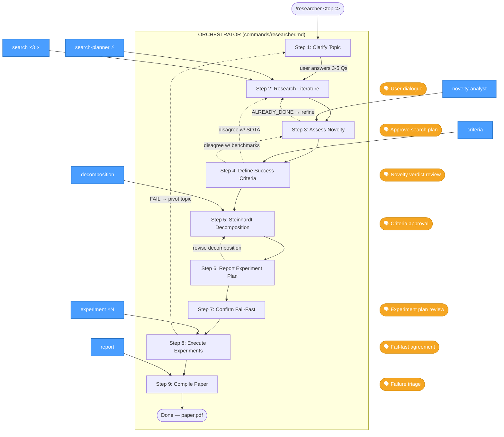
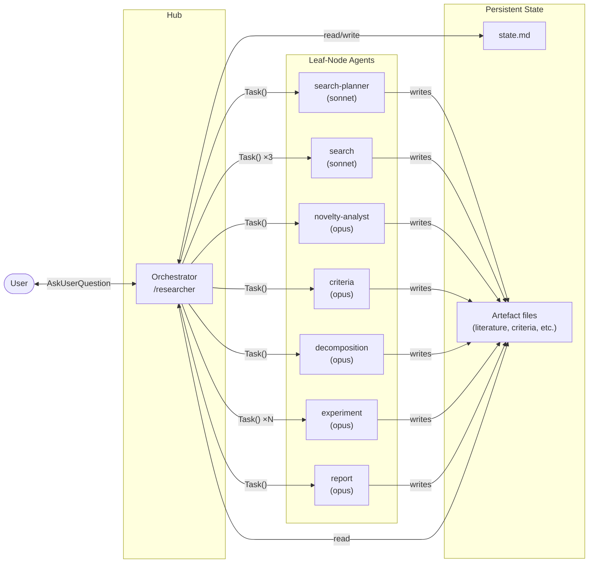
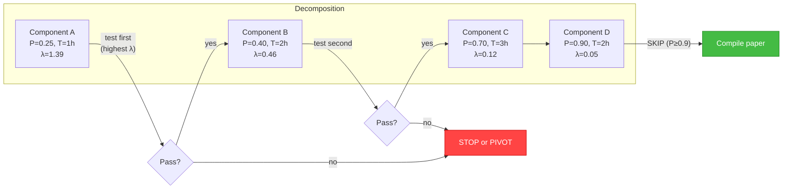
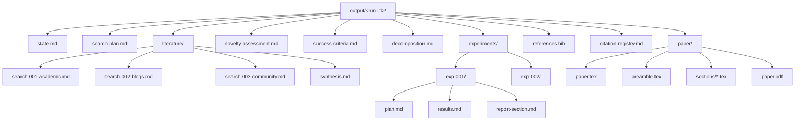

# Architecture Diagram

## Workflow Overview

```mermaid
flowchart TD
    User(["/researcher &lt;topic&gt;"]) --> S1

    subgraph ORCH["ORCHESTRATOR (commands/researcher.md)"]
        S1["Step 1: Clarify Topic"]
        S2["Step 2: Research Literature"]
        S3["Step 3: Assess Novelty"]
        S4["Step 4: Define Success Criteria"]
        S5["Step 5: Steinhardt Decomposition"]
        S6["Step 6: Report Experiment Plan"]
        S7["Step 7: Confirm Fail-Fast"]
        S8["Step 8: Execute Experiments"]
        S9["Step 9: Compile Paper"]
        Done(["Done — paper.pdf"])

        S1 -->|"user answers 3-5 Qs"| S2
        S2 --> S3
        S3 --> S4
        S4 --> S5
        S5 --> S6
        S6 --> S7
        S7 --> S8
        S8 --> S9
        S9 --> Done
    end

    %% Loop-backs
    S3 -.->|"ALREADY_DONE → refine"| S2
    S4 -.->|"disagree w/ SOTA"| S2
    S4 -.->|"disagree w/ benchmarks"| S3
    S6 -.->|"revise decomposition"| S5
    S8 -.->|"FAIL → pivot topic"| S1

    %% Agents
    SP["search-planner ⚡"]:::agent --> S2
    SE["search ×3 ⚡"]:::agent --> S2
    NA["novelty-analyst"]:::agent --> S3
    CR["criteria"]:::agent --> S4
    DE["decomposition"]:::agent --> S5
    EX["experiment ×N"]:::agent --> S8
    RE["report"]:::agent --> S9

    %% User interaction points
    S1 ~~~ U1(["🗣 User dialogue"]):::user
    S2 ~~~ U2(["🗣 Approve search plan"]):::user
    S3 ~~~ U3(["🗣 Novelty verdict review"]):::user
    S4 ~~~ U4(["🗣 Criteria approval"]):::user
    S6 ~~~ U6(["🗣 Experiment plan review"]):::user
    S7 ~~~ U7(["🗣 Fail-fast agreement"]):::user
    S8 ~~~ U8(["🗣 Failure triage"]):::user

    classDef agent fill:#4a9eff,stroke:#2670c2,color:#fff
    classDef user fill:#f5a623,stroke:#d48b0c,color:#fff
```

## Hub-and-Spoke Architecture

```mermaid
flowchart LR
    subgraph Hub
        O["Orchestrator\n/researcher"]
    end

    subgraph Agents["Leaf-Node Agents"]
        A1["search-planner\n(sonnet)"]
        A2["search\n(sonnet)"]
        A3["novelty-analyst\n(opus)"]
        A4["criteria\n(opus)"]
        A5["decomposition\n(opus)"]
        A6["experiment\n(opus)"]
        A7["report\n(opus)"]
    end

    subgraph State["Persistent State"]
        SM["state.md"]
        AR["Artefact files\n(literature, criteria, etc.)"]
    end

    U(["User"]) <-->|"AskUserQuestion"| O
    O -->|"Task()"| A1
    O -->|"Task() ×3"| A2
    O -->|"Task()"| A3
    O -->|"Task()"| A4
    O -->|"Task()"| A5
    O -->|"Task() ×N"| A6
    O -->|"Task()"| A7

    A1 -->|writes| AR
    A2 -->|writes| AR
    A3 -->|writes| AR
    A4 -->|writes| AR
    A5 -->|writes| AR
    A6 -->|writes| AR
    A7 -->|writes| AR

    O <-->|"read/write"| SM
    O <-->|"read"| AR
```

## Fail-Fast Lambda Ordering

```mermaid
flowchart LR
    subgraph Decomposition
        C1["Component A\nP=0.25, T=1h\nλ=1.39"]
        C2["Component B\nP=0.40, T=2h\nλ=0.46"]
        C3["Component C\nP=0.70, T=3h\nλ=0.12"]
        C4["Component D\nP=0.90, T=2h\nλ=0.05"]
    end

    C1 -->|"test first\n(highest λ)"| R1{Pass?}
    R1 -->|yes| C2
    R1 -->|no| STOP["STOP or PIVOT"]
    C2 -->|"test second"| R2{Pass?}
    R2 -->|yes| C3
    R2 -->|no| STOP
    C3 --> C4
    C4 -->|"SKIP (P≥0.9)"| PAPER["Compile paper"]

    style STOP fill:#ff4444,stroke:#cc0000,color:#fff
    style PAPER fill:#44bb44,stroke:#228822,color:#fff
```

## Output Directory Structure

```mermaid
flowchart TD
    OUT["output/&lt;run-id&gt;/"] --> SM["state.md"]
    OUT --> SP["search-plan.md"]
    OUT --> LIT["literature/"]
    OUT --> NOV["novelty-assessment.md"]
    OUT --> SC["success-criteria.md"]
    OUT --> DEC["decomposition.md"]
    OUT --> EXP["experiments/"]
    OUT --> REF["references.bib"]
    OUT --> CIT["citation-registry.md"]
    OUT --> PAP["paper/"]

    LIT --> L1["search-001-academic.md"]
    LIT --> L2["search-002-blogs.md"]
    LIT --> L3["search-003-community.md"]
    LIT --> L4["synthesis.md"]

    EXP --> E1["exp-001/"]
    EXP --> E2["exp-002/"]
    E1 --> E1P["plan.md"]
    E1 --> E1R["results.md"]
    E1 --> E1S["report-section.md"]

    PAP --> PT["paper.tex"]
    PAP --> PP["preamble.tex"]
    PAP --> PS["sections/*.tex"]
    PAP --> PDF["paper.pdf"]
```
